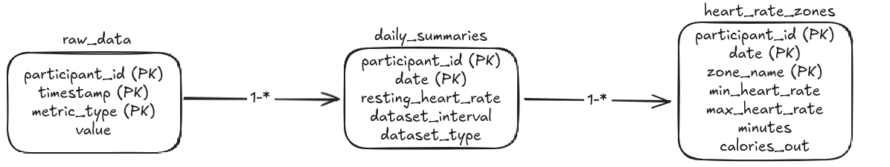

# Stanford Snyder Lab Challenge

This repository contains the code for this challange and this readme should guide you through the entire repository and the performed tasks.

Please make sure docker, docker-compose and python is installed, and Python must be accessible by the python command, not python3, for the combined scripts to work; otherwise, changes in the `setup.sh` file will be required.

For exploring the first three tasks as those were implemented you should checkout to the commit sha where I pushed the code for the tasks originally. Their code changes later on because of the fourth task. so to explore the first three tasks, run the following command:

```bash
git checkout f0831f9a716c254dcbc0f4a9f3e0c3897a364a7c
```

for the other tasks their commit sha is mentioned in their section. And to come back to the latest commit, run:

```bash
git checkout main
```

Before running any `setup.sh` command, please run
```bash
chmod +x ./setup.sh
```
to make it executable, otherwise you will get a permission denied error.

# Tasks
- ## Task 0.a: Data Volume Estimation
    The data volume estimation task as mentioned in the challenge description has been solved in the notebook linked below.
    
    [Task 0.a: Data Volume Estimation](./notebooks/data_estimates.ipynb)

- ## Task 0.b: Data Extraction
    [Task 0.b: Data Extraction](./notebooks/data_extraction.ipynb)

    The data was extracted according to the instructions provided in the PDF. While exporting to JSON, an issue arose because the heart rate metric contains `int64` and `float64` values, which are not directly JSON serializable by Python’s standard `json` module. So we had to convert these values to standard Python types (`int` and `float`) before serialization. The code for this task is provided in the notebook linked below and this [file](./misc/create_data.py)
    
    **Error encountered:**
    ```
    ---------------------------------------------------------------------------
    TypeError                                 Traceback (most recent call last)
    /tmp/ipython-input-9-2871909349.py in <cell line: 0>()
        13   json.dump(azm, open("azm.json", "w"))
        14   json.dump(activity, open("activity.json", "w"))
    --> 15   json.dump(hr, open("hr.json", "w"))
        16   json.dump(hrv, open("hrv.json", "w"))
        17   json.dump(spo2, open("spo2.json", "w"))

    12 frames
    /usr/lib/python3.11/json/encoder.py in default(self, o)
        178 
        179         """
    --> 180         raise TypeError(f'Object of type {o.__class__.__name__} '
        181                         f'is not JSON serializable')
        182 

    TypeError: Object of type int64 is not JSON serializable
    ```

    To create the data, there is a simplified version I created for it, you can just run the following command in the terminal while being in project root directory:
    ```bash
    ./setup.sh 0
    ```

- ## Task 1: Ingestion
    The ingestion task is solved, and it's related files are [Dockerfile](./Dockerfile), [docker-compose.yml](./docker-compose.yml), [init.sql](./init-db/init.sql) and [ingestion.py](./ingestion/ingestion.py). For ease, you may run the [setup.sh](./setup.sh) script to run the entire write flow. This doesn't currently use the Fitbit API, because building upon the previous task, it was assumed by me that we have to use the synthetic data instead, so the script basically ingests with a simulated date starting from the first date of the synthetic data and then ingests it via a cron job that runs at 1 AM every day, and updates the data in a delta-load fashion as asked in the challenge description.
    
    For the task, timescaleDB was used, because I have a past experience working with Postgres, and since this is just an extension of Postgres, I thought it would be a good fit for the task. TimeseriesDb have a great advantage over normal DBs when it comes to processing and efficiently storing timeseries data, this is because of many reasons, most important one being storing in a delta format, where only the change is stored. More on this is discussed in the [Task 0a](#task-0a-data-volume-estimation).

    The schema of this looks like this, with raw_data being a hypertable.
    

    For running this, please look at the `./setup.sh`, it contains all the commands for this and you can even run it directly to setup the database and the ingestion flow.

    You can directly run this task by running the following command in the terminal:
    ```bash
    ./setup.sh 1
    ```

- ## Task 2: Access
    The access task is solved by creating FastAPI endpoint that can be used to access the data. After that a simple frontend application is made using React, and charts are visualized using Recharts. You can find both at the following links:
    - [FastAPI Backend](./backend)
    - [React Frontend](./frontend)
    For running this task just run the following command in the terminal:
    ```bash
    ./setup.sh 2
    ```
    It's supposed to run everything in order after that you can access the frontend at `http://localhost:5173`. All four params which were mentioned in the task are implemented in the frontend. To prevent rendering issues because of huge number of data points, the data is downsampled to 500 points max. These are also containerized using Docker and can be run directly via the `docker-compose.yml` file. The backend is running on port `5000` and the frontend on port `5173`. The frontend is also containerized and can be run using the same `docker-compose.yml` file.
- ## Task 3: Optimization
    The optimization task basically just improves the implementation, there are not materialized view in timescaleDB which can optimize the queries. The backend and the frontend implementation is adopted accordingly and now use makes better use of best practices. The queries are optimized to use the materialized views and the frontend is updated to use the new endpoints. The code for this task is in the same directories as the previous task, so you can just run the same command as before to run this task, which is `./setup.sh 2` but I've also added support for this task seperately for separation purposes, so you can also run the following command to run this task: 
    ```bash
    ./setup.sh 3
    ```
    This is build on the previous task so you won't be able to explore the previous task in this commit sha, so you can just checkout to the previous commit sha to explore the previous task. That is given on top of this readme.
    The main changes in this task are:
    - Added materialized views to the database to optimize the queries. [init.sql](./init-db/init.sql)
    - Updated the backend to use the materialized views. [FastAPI Backend](./backend)
    - Updated the frontend to use the new endpoints. [React Frontend](./frontend)
    
    Pagination is supported in the frontend and the backend, it's implemented in a cursor based pagination style which is more efficient for timeseries data. Along with that multiple aggregation styles are available in the frontend. The aggregation is based on timestamps, so those are only going to work when real time ingestion is done, since ingestion is of synthetic data, the aggregation is not going to work as expected. But all of it is implemented in the `init.sql`. In the frontend, the Automatic aggregation is implemented, but since the data might not be aggregated, you might have to select the raw data to see the data in charts. To check the exact implementation of this task, you may checkout to this exact commit SHA.
    ```bash
    git checkout b7bb832355a2f7368c711f0ac83a0188c31f71c0
    ```

    Another thing that the pagination is implemented, and there isn't any limit to how many data points you can fetch in one page for demonstration. So if you enter are really higher number the application might hang, so please be careful with that. Default is set to 100 data points, and there is a downsample set in the frontend as a safety measure, so that the charts don't hang when there are too many data points.

- ## Task 4: Analysis Dashboard
    There are some issues with this because of the assumptions made implementing previous tasks, and the general limitations of synthetic data. The sleep param in fitbit API doesn't produce any synthetic data, so sleep analysis will just returns dummy data in my endpoints. About a participant not uploading data in some hours, for this case it's only implemented for the one user that we have in our synthetic data. Another thing is that since we don't have a list of users which let's say have provided tokens or haven't, which was one of the requirement of this task. So I make a dummy list of users with just the user one providing token and the rest not having any token. This is just to simulate an actual clinical trial. There is a slight change in aggregation, so that the aggregation which wasn't really observable before, it now happens every 5 minutes and for the past 1000 days, this should be good enough for demonstration purposes, but will need to be updated when real time ingestion is done. Majority things in this implemented are dummy and are just for demonstration purposes because of data constraints. You can run this code by just running the following command in the terminal:
    ```bash
    ./setup.sh 4
    ```
    This will add dummy users and the data of the user 1 will be the synthetic data that we have, the code for other users isn't available so that's not used in this demonstration. A new table has been added to the schema, which is `users`.
    The change log for this task is:
    - Added a new table `users` to the schema, and updated aggregation time [init.sql](./init-db/init.sql)
    - Updated the backend to use the new table and new routes for dashboard. [FastAPI Backend](./backend)
    - Updated the frontend to use the new routes and display the different dashboards. [React Frontend](./frontend)
    - Modularize the frontend code to make it more maintainable and readable.

    You can explore the exact task implementation by checking out to this commit sha:
    ```bash
    git checkout 488910041e553589a25100a0faaf3b4a04787afa
    ```

- ## Task 5: Monitoring
    This task required a lot of research and study because I haven't worked with monitoring tools before. Here are some links which you may use to see my implementation:

    - [http://localhost:9090/targets](http://localhost:9090/targets) - This is the Prometheus targets page, where you can see the targets that are being monitored.
    Ingestion might show up as unhealthy because it turns off after ingetion, but that is expected behaviour.
    - [http://localhost:3000/d/fitbit-monitoring/fitbit-monitoring-dashboard](http://localhost:3000/d/fitbit-monitoring/fitbit-monitoring-dashboard) - This is the Grafana dashboard, where you can see the metrics being monitored.
    - [http://localhost:8080/containers/](http://localhost:8080/containers/) - This is the cAdvisor dashboard, where you can see the container metrics being monitored.
    - [http://localhost:9093/#/alerts](http://localhost:9093/#/alerts) - This is the Alertmanager dashboard, where you can see the alerts being monitored.

    For running this task, you can just run the following command in the terminal:
    ```bash
    ./setup.sh 5
    ```

    But before that kindly create the following file
    `./monitoring/alertmanager/smtp_password.txt`
    with the contents provided in the email, and kindly update the alertmanager.yml with the email you need to send the emails to. I'm sure there are cleaner ways to do this but due to time constraints I had to do it this way. The ingestion will send alerts, and the container will stop after ingestion so there will be an email regarding that as well. The email will be sent to the email you provided in the `alertmanager.yml` file.


The ingestion of all tasks has been reduced to 2 days because 30 took very long, you can easily change that via the `./setup.sh` file.
